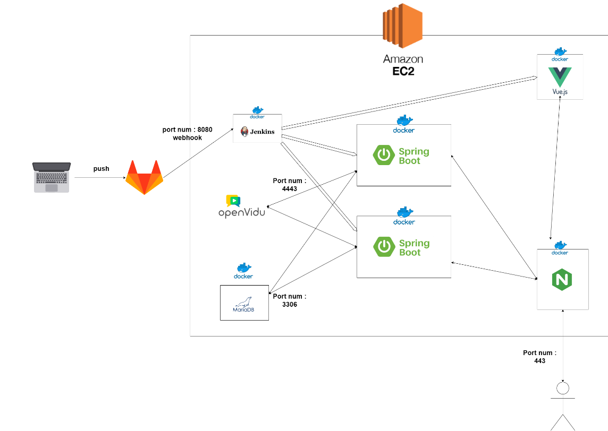

# Dear ME ❤️‍🩹

## 목차
- [기획배경](#기획배경)
- [프로젝트 소개](#프로젝트-소개)
- [프로젝트 기간](#프로젝트-기간)
- [주요 자료](#주요-자료)
- [팀원 소개](#팀원-소개)
- [기능 소개](#기능-소개)
- [시스템 아키텍처](#시스템-아키텍처)
- [기술 스택](#기술-스택)
- [설치](#설치)
- [폴더 구조](#폴더-구조)

## 기획배경

- 청년취업난과 코로나블루의 대두로 우울감을 느끼는 청년들이 많아졌습니다. 하지만 현재 대한민국에서는 심리 치료와 상담에 대해 상대적으로 부정적인 시선과 인식이 많아 진입 장벽이 높습니다. 이에 일기를 통해 자신도 몰랐던 자신의 모습을 알아가고 비대면 화상 상담을 통해 청년 특히, 취업 준비생들이 심리적으로 안정을 찾는 데 도움이 되는 서비스를 기획하게 되었습니다.

## 프로젝트 소개

- 심리적으로 지친 취업 준비생들을 위한 WebRTC 기반 화상일기, 텍스트일기, 화상상담 등의 멘탈 케어 서비스

## 프로젝트 기간

- SSAFY 공통 웹기술 프로젝트 2022.07.05 ~ 2022.08.19 (7주)

## 주요 자료
- [SSAFY 7기 공통 D206 Notion](https://www.notion.so/Dear-Me-3f5087884137450a9570d15913d87fac)
- [SSAFY 7기 공통 D206 Figma](https://www.figma.com/file/axgyuL7MwNSIVYPm3B821z/D206?node-id=430%3A3589&t=VNkycd2vew1EyO3v-1)

## 팀원 소개

|   이름   |     [정윤해](https://github.com/JEONGYOONHAE)         |     [이기종](https://github.com/LeeKiJong)     |     [이상민](https://github.com/Sangmeeeee)     |     [강지명](https://github.com/rainbow77777)     |     [장수영](https://github.com/dearsyjang)     |     [최지상](https://github.com/)     |
| :------------: | :----------: | :----------: | :----------: | :----------: | :----------: | :----------: |
|  포지션  |                 Team Leader<br/>Front-end                 |         Back-end        |            Back-end<br/>        | Front-end| Front-end | Front-end |

## 기능 소개

| 구분                             | 기능                           | 설명                                    |
| ---------------------------------------------------------------- | -------------------------------------------------------------- | --------------------------------------- |
| 회원                             | 회원가입<br/>로그인 & 로그아웃 | -  |
| 일기                        | 화상 일기                   | -             |
| 일기                      | 텍스트 일기                    | -   |
| 감정 달력                  | 감정 달력                    | -   |
| 감정 달력                  | 감정 분석                    | -   |
| 심리 상담 | 상담 신청 |- |
| 심리 상담 | 1:1 상담                      | -     |
| 심리 상담 | 그룹 상담                      | -  |
| 심리 상담 | 상담 평가                      | -     |
| 상담 게시판 | 게시글                      | -    |
| 상담 게시판 | 댓글                      | - |
| 결제  | 카카오페이 결제                    | -  |
| 마이페이지  | 상담사<br/>취업준비생                      | -  |


### 기능별 이미지
추후 추가 예정...

## 시스템 아키텍처



## 기술 스택

**[ FRONT-END ]**

- **Vue3**
- **JavaScript**
- **Noe.js 16.16.0**
- **HTML, CSS**
- **BootStrap 5.2.0**

**[ BACK-END ]**

- **JAVA**
  - jdk 11
- **Spring Boot 2.7.2**
- **Zulu**
- **Docker 20.10.12**
- **Jenkins 2.346.2**
- **Nginx 1.23.1**
- **MariaDB 10.8.3**
- **Openvidu 2.22.0**

## 설치

서비스를 사용하기 위해서는 다음과 같은 방법으로 실행합니다.

**[ BACK-END ]**

1. 백엔드를 실행합니다.

```java

```

**[ FRONT-END ]**

1. frontend 폴더에서 패키지를 설치하고 실행합니다.

```jsx
npm install
```
```jsx
npm run serve
```

## 폴더 구조

**[ FRONT-END ]**

```
📁frontend
  ├── 📁public
  ├── 📁src
  │ ├─ 📁api # Axios 데이터 통신
  │   └─ 📄drf.js
  │ ├─ 📁assets
  │ │ 📁css
  │ └─ 📁images
  │ ├─ 📁router
  │ ├─ 📁store
  │ ├─ 📁views
  │ ├─ 📄App.vue
  │ └─ 📄main.js
  ├─ 📄.gitignore
  ├─ 📄.babel.config.js
  ├─ 📄.jsconfig.json
  ├─ 📄package-lock.json
  ├─ 📄package.json
  └─ 📄vue.config.js
```


**[ BACK-END ]**

```
└── 📁back
  ├── 📁demo
  │ ├── 📁.mvn
  └─  ├─ 📁src
      ├─ 📄.gitignore
      ├─ 📄
      ├─ 📄
      ├─ 📄
      ├─ 📄
      └─ 📄
```
